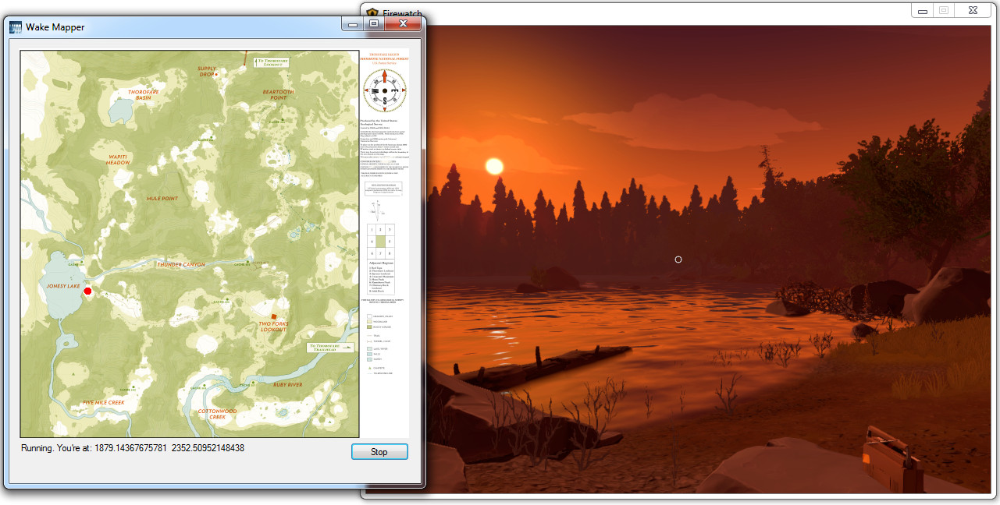
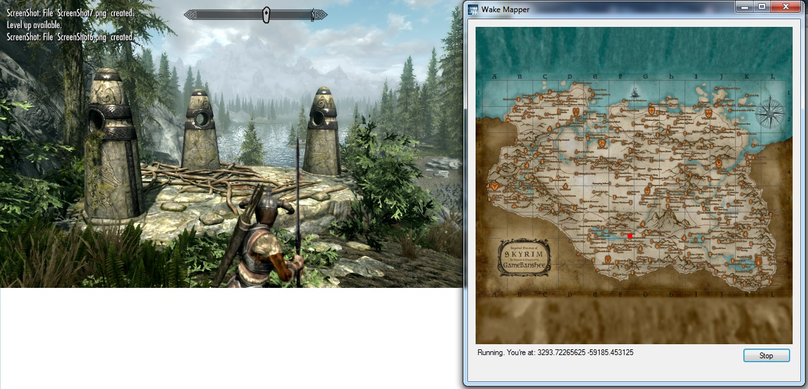

# README #

WakeMapper is a program that interacts with video games to display the player's position on a map. The program currently supports Alan Wake, Firewatch and Skyrim Special Edition. (The Long Dark used to be supported, but various new releases broke compatibility).

# Download #
64 bit version (supports all games): https://bitbucket.org/Sofox/wakemapper/downloads/WakeMapper64.exe

32 bit version (only supports Alan Wake): https://bitbucket.org/Sofox/wakemapper/downloads/WakeMapper.exe

The program is standalone, and runs without needing an install.

If you have issues running this (eg. "This application was unable to start correctly"), try updating the .NET runtime on your computer.

### Build Instructions ###

The program is built using Microsoft Visual Studio Community 2019. This free program should be able to open, edit, build and run the program. Earlier versions build with 2015, but otherwise not tested with other Visual Studio versions.

Visual Studio Community can be freely downloaded from: https://www.visualstudio.com, although it may require registration.

### Contribution guidelines ###

Anyone who wants to make any modifications or additions to this program is welcome. It might be helpful to contact me first though (contact details below).

### Map credits ###
The Alan Wake map comes from a scan of official merchandise (as seen here: http://alanwake.wikia.com/wiki/Bright_Falls ) combined with an in game texture of an in game wallmap.

The Firewatch map technically comes from an in game texture, but more accurately comes from a "clean" high res version of that texture provided by the game's developers: http://blog.camposanto.com/post/140041752129/downloadable-printable-firewatch-maps-for-you-a

The Long Dark maps, with the exception of the overview map (provided by the dev team), were created by Whiteberry (@toarda). You can see all her maps (including some versions that have more information) here: https://steamcommunity.com/sharedfiles/filedetails/?id=530202531 (once again, TLD is no longer supported due to new versions being released)

Skyrim map provided by GameBanshee: http://www.gamebanshee.com/skyrim/mapofskyrim.php (link provides high quality version of map and text index of locations)

### Game Credits ###

Alan Wake created by Remedy Entertainment

Firewatch created by Campo Santo

The Long Dark created by Hinterland Games

The Elder Scrolls V: Skyrim Special Edition created by Bethesda Game Studios

### Technical information ###

The Steam version of all games were tested with this program on a 64 bit Windows 7 PC

GIMP image editor was often used to edit, tweak and scale maps.

Cheat Engine ( http://www.cheatengine.org ) played an invaluable part in finding the player position values in memory, and helping me access them even if the game restarts. 

### Who do I talk to? ###

Sofox is the owner of the project. Email at sofoxx [-at-] gmail [*dot*] com