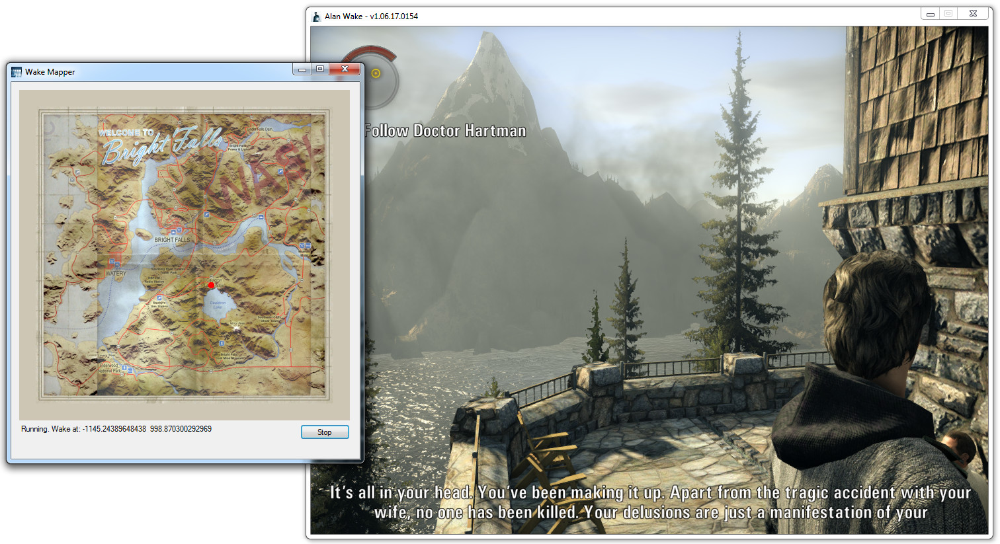

# README #

WakeMapper is a program that interacts with the video game Alan Wake (by Remedy Entertainment) to display the player's position on a map.

You can download a binary here: https://bitbucket.org/Sofox/wakemapper/downloads/WakeMapper.exe

The program is standalone, and runs without needing an install.

The map inside the program comes from a scan of official merchandise (as seen here: http://alanwake.wikia.com/wiki/Bright_Falls ) combined with an in game texture of an in game wallmap.

### Build Instructions ###

The program is built using Microsoft Visual Studio Community 2015. This program should be able to open open, build and run the program.

Visual Studio Community can be freely downloaded from: https://www.visualstudio.com , although it may require registration.

### Contribution guidelines ###

Anyone who wants to make any modifications or additions to this program is welcome. It might be helpful to contact me first though (contact details below).

### If you don't have Alan Wake... ###

Steam: http://store.steampowered.com/app/108710/

GOG: https://www.gog.com/game/alan_wake (program not tested with GOG Alan Wake, only Steam version on a 64 bit, Windows 7 PC)

### Who do I talk to? ###

Sofox is the owner of the project. Email at sofoxx [-at-] gmail [*dot*] com